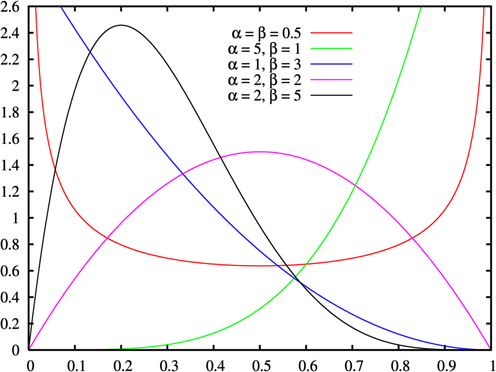
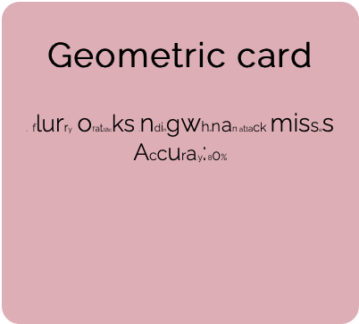

# QueenBetty
## Auteurs
LUONG Guy\
N'GOTTA Sarah\
PORA Aude

## Sources
[Lien GitHub](https://github.com/firisthetraveller/QueenBetty)

## Description

Une simulation de combat au tour par tour entre deux personnages, style [Pokémon](https://en.wikipedia.org/wiki/Pokémon), où toutes les attaques dépendent de loi de probabilités.

Le combat se termine quand l'un des deux combattants tombe au combat en recevant un nombre de dégâts fixé.

Des événements arrivent au cours du combat, infligeant des dommages aux deux joueurs ou les soigne.

Dans ce rapport, nous allons décrire les différentes lois utilisées, leurs cas d'utilisation et les stratégies avec les chaînes de Markov tout en faisant des analogies à Pokémon.

## Lois utilisées

On utilise ici 4 lois de probabilités à distribution discrète pour 4 différentes attaques possibles :

### La **loi uniforme** (discrète)
À valeurs dans 1 à $n$, elle détermine le nombre de dommages infligés à l'adversaire, multiplié par un scalaire.

| Espérance       | Variance             |
| --------------- | -------------------- |
| $\frac{n+1}{2}$ | $\frac{n^2 - 1}{12}$ |

Exemple :
>Pour un lancer de dé (à valeurs de 1 à 6), on obtient un 4. On multiplie ce résultat par un scalaire $x$ donné, et ça détermine le nombre total de dommages.
>
>Dommages totaux = $4 * x$

On s'en sert aussi pour l'affichage de texte dans le terminal dans le cas d'une certaine attaque, la position des taches affichées à l'écran (expliqué avec la loi de Poisson), etc.

### La **loi de Bernoulli**
Assimilé à un lancer de pièce possiblement truqué, avec une probabilité de succès $p$, on l'utilise pour simuler une attaque risquée, infligeant beaucoup de dégâts en cas de succès, 0 dans le cas contraire.

| Espérance | Variance   |
| --------- | ---------- |
| $p$       | $p(1 - p)$ |

Exemple :
> Un lancer de pièce avec une probabilité $p = 0.5$, infligeant 20 dégâts en cas de succès. 

### La **loi géométrique** (discrète)
Aussi appelée la loi du premier succès, avec une probabilité de succès $p$. On l'utilise ici à l'envers, où le premier succès est le *premier échec*, de probabilité $q = 1-p$.

Une variable aléatoire $X$ suivant cette loi de paramètre $q$ aura comme valeur le numéro de l'essai échoué, à valeurs entières dans $1$ à $+\infty$. 

Les attaques ainsi représentées continuent d'infliger des dommages fixes tant que les attaques ne ratent pas.

On rendrait facilement l'attaque très puissante en rapprochant $p$ vers $1$, ou $q$ vers $0$.

| Espérance     | Variance            |
| ------------- | ------------------- |
| $\frac{1}{q}$ | $\frac{1 - q}{q^2}$ |

Exemple :
> On imagine ici quelque chose qui ressemble à l'attaque "[Roulade](https://www.pokepedia.fr/Roulade)" de Pokémon, une attaque à 90% de précision et des dégâts à base 30.
>
>Ici : $p = 0.9$, et on simplifiera pour les dégâts: 30. On ignorera les dégâts doublés et les effets spéciaux.
>
> Par la formule de l'espérance, le premier échec arriverait au 10e essai, touche donc 9 fois pour 30 dégâts chacun : 270 dégâts au total.

### [Balle-Graine](https://www.pokepedia.fr/Balle_Graine), une loi personnalisée
En étudiant une autre attaque de Pokémon, on obtient une nouvelle loi non uniforme.

Dans le jeu, l'attaque touche de 2 à 5 fois, avec une probabilité de toucher :
- 2 fois avec 0.375,
- 3 fois avec 0.375,
- 4 fois avec 0.125,
- et 5 fois avec 0.125.

La somme des probabilités vaut bien 1, il s'agit bien d'une loi.

On calcule maintenant l'espérance.

$E(X) = \sum_{1}^{5}{i * P(X=i)}$

$\qquad= 2 * 0.375 + 3 * 0.375 + 4 * 0.125 + 5 * 0.125$

$\qquad= 2 * 3 * 0.125 + 3 * 3 * 0.125 + 4 * 0.125 + 5 * 0.125$

$\qquad= 0.125 * (6 + 9 + 4 + 5)$

$\qquad= 0.125 * 24$

$\qquad= 3$

On calcule maintenant la variance :

$Var(X) = E(X^2) - E(X)^2$

$\qquad= \sum_{1}^{5}{i^2 * P(X = i)} - 3^2$

$\qquad= 0.125 * (12 + 27 + 16 + 25) - 9$

$\qquad= 0.125 * 80 - 9$

$\qquad=10 - 9 = 1$

Il est également possible de changer les probabilités $P(X = i)$ résultant en une nouvelle loi, dont l'espérance et la variance se calculent de la même façon.

### Loi exponentielle
Une variable aléatoire réelle suivant une loi exponentielle représente le temps d'attente entre deux événements.

Ici, on a choisi de déclencher une `Catastrophe` ou une `Bénédiction` à des intervalles différents, dont le temps d'attente suit une loi exponentielle de paramètre $\lambda$.

| Espérance           | Variance              |
| ------------------- | --------------------- |
| $\frac{1}{\lambda}$ | $\frac{1}{\lambda^2}$ |

Le temps d'attente ici étant un entier positif (*le nombre de tours*), on choisit une valeur de $\lambda$ inférieure à 1.

On obtient donc :
- Avec $\lambda = 0.3$, à peu près tous les 3 tours, une `Catastrophe` se produit.
- Avec $\lambda = 0.5$, en moyenne tous les 2 tours, une `Bénédiction` se produit.

### Loi de Poisson de paramètre $\lambda$
Elle symbolise le nombre d'événements arrivant par unité de temps.

Pour l'illustrer, nous avons choisi d'afficher des taches noires à l'écran chaque seconde, dont le nombre de nouvelles taches suit cette loi.

| Espérance | Variance  |
| --------- | --------- |
| $\lambda$ | $\lambda$ |

### Loi de Laplace
La taille de ces tâches suivent une loi de Laplace.

C'est une loi à deux paramètres ($\mu$ et $b$), telle que $\mu$ représente le décalage à 0 du pic de probabilités, et $b$ étant inversement proportionnel à l'intensité du pic.

Source : Wikipédia, [loi de Laplace](https://fr.wikipedia.org/wiki/Loi_de_Laplace_(probabilités))

Cela revient à avoir une probabilité très forte d'avoir des nombres proches de $\mu$, mais qui s'étalent quand b est grand.

| Espérance | Variance |
| --------- | -------- |
| $\mu$     | $2b^2$   |

La taille des taches suit la loi de Laplace, par défaut avec $\mu = 20$ et $b = 5$, pour avoir des taches d'une taille tournant autour de $40$px et une disparité non négligeable.

### Loi bêta
La loi bêta est une loi à distribution continue, avec diverses fonctions de densité.

Nous avons ici choisi de l'appliquer sur la taille des caractères lors de l'affichage des cartes, avec la taille des caractères suivant une loi bêta de paramètres $\alpha = 0.5$ et $\beta = 0.5$. 

Cela représente d'après le graphique ci-dessus un nombre important de caractères ayant une taille proche de 0 et de la taille maximale donnée.

*Exemple d'application, on voit bien beaucoup de lettres de taille normale (les grandes), on voit surtout les lettres très petites, et peu de lettres intermédiaires.*

| Espérance                       | Variance                                                      |
| ------------------------------- | ------------------------------------------------------------- |
| $\frac{\alpha}{\alpha + \beta}$ | $\frac{\alpha \beta}{(\alpha + \beta)^2(\alpha + \beta + 1)}$ |

### Loi normale de Gauss
La loi de Gauss est la loi qui décrit des phénomènes naturels, et estime les erreurs probables.

| Espérance | Variance   |
| --------- | ---------- |
| $\mu$     | $\sigma^2$ |

On s'en sert ici pour ajouter de l'erreur dans l'affichage des points de vie.

## La simulation

Il est possible de régler des paramètres des lois de probabilité !

- En réglant le paramètre $\lambda$ de la loi de Poisson, on peut changer la fréquence d'apparition des taches noires.

- Avec les paramètres de la loi de Laplace, on contrôle la taille des taches: $\mu$ contrôle la taille moyenne des taches et $b$ la variété de la grosseur de ces taches.

Les paramètres des autres lois nécessitent un relancement d'un combat pour voir le résultat.

- Les paramètres $\alpha$ et $\beta$ de la loi bêta contrôlent la grosseur de la taille du texte des cartes en bas de l'écran. Le paramètre $\alpha$ fait tendre la taille des lettres vers la taille d'origine, tandis que $\beta$ tend à les réduire au minimum. On joue donc avec un équilibre entre ces deux paramètres.

- Les paramètres de la Loi de Gauss permettent d'ajouter de l'erreur dans l'affichage coloré de la barre de vie des personnages. La moyenne, par défaut à $0$, permet de situer la valeur autour de laquelle les valeurs vont être générées.

## Les chaînes de Markov
Ce sont des structures de données à état associant une probabilité à une action dépendant uniquement de l'état courant.

Ici, on s'en sert pour simuler les stratégies des personnages, et elles dépendent du coup précédemment utilisé. On peut ainsi représenter différents patterns ou comportements, des attaques qui doivent avoir un temps de charge (ex: [Lance-Soleil](https://www.pokepedia.fr/Lance-Soleil)) ou un temps de recul (ex: [Ultralaser](https://www.pokepedia.fr/Ultralaser)).

## Difficultés
À la base, ce projet était censé être un jeu, mais par manque de temps et d'une manque de vision sur le temps que ça prendrait d'ajouter les interactions avec un joueur physique, nous avons décidé de le laisser en tant que simulation de combat au tour par tour.

De plus, nous n'avons pas réussi à ralentir le rythme du jeu, résultant à des combats se déroulant instantanément, sans possibilité de voir les différentes interactions: notamment les `Catastrophes` et les `Bénédictions` qui auraient été intéressantes à montrer.
